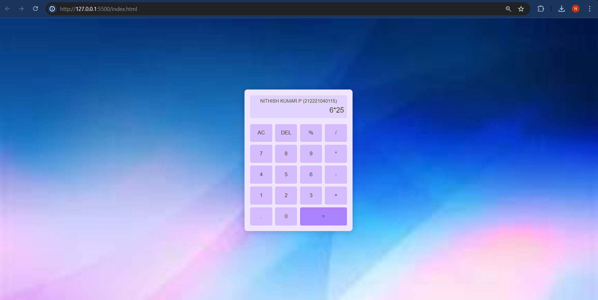

index.html

```
<!DOCTYPE html>
<html lang="en">
<head>
    <meta charset="UTF-8">
    <meta name="viewport" content="width=device-width, initial-scale=1.0">
    <title>Calculator</title>
    <link rel="stylesheet" href="styles.css">
</head>
<body>
    <div class="container">
        <div class="calculator">
            <div class="display">
                <div id="name">NITHISH KUMAR P (212221040115)</div>
                <div id="result"></div>
            </div>
            <div class="buttons">
                <button onclick="clearDisplay()">AC</button>
                <button onclick="deleteChar()">DEL</button>
                <button onclick="appendChar('%')">%</button>
                <button onclick="appendChar('/')">/</button>
                <button onclick="appendChar('7')">7</button>
                <button onclick="appendChar('8')">8</button>
                <button onclick="appendChar('9')">9</button>
                <button onclick="appendChar('*')">*</button>
                <button onclick="appendChar('4')">4</button>
                <button onclick="appendChar('5')">5</button>
                <button onclick="appendChar('6')">6</button>
                <button onclick="appendChar('-')">-</button>
                <button onclick="appendChar('1')">1</button>
                <button onclick="appendChar('2')">2</button>
                <button onclick="appendChar('3')">3</button>
                <button onclick="appendChar('+')">+</button>
                <button onclick="appendChar('.')">.</button>
                <button onclick="appendChar('0')" class="zero">0</button>
                <button onclick="calculateResult()" class="equal">=</button>
            </div>
        </div>
    </div>
    <script src="script.js"></script>
</body>
</html>

```

styles.css

```
body {
    margin: 0;
    display: flex;
    justify-content: center;
    align-items: center;
    height: 100vh;
    background: url(bg.jpeg);
    background-size: cover;
    font-family: Arial, sans-serif;
}

.container {
    display: flex;
    justify-content: center;
    align-items: center;
    height: 100%;
}

.calculator {
    background: #f0e4ff;
    padding: 20px;
    border-radius: 10px;
    box-shadow: 0 0 20px rgba(0, 0, 0, 0.2);
    text-align: center;
}

.display {
    background: #e0d4ff;
    padding: 10px;
    margin-bottom: 20px;
    border-radius: 5px;
}

.display #name {
    font-size: 16px;
    color: #333;
}

.display #result {
    font-size: 24px;
    color: #333;
    margin-top: 10px;
    min-height: 30px;
    text-align: right;
}

.buttons {
    display: grid;
    grid-template-columns: repeat(4, 1fr);
    gap: 10px;
}

button {
    padding: 20px;
    border: none;
    border-radius: 5px;
    background: #d3bcff;
    font-size: 18px;
    color: #333;
    cursor: pointer;
    transition: background 0.3s;
}

button:hover {
    background: #bba1ff;
}

button.equal {
    grid-column: span 2;
    background: #a882ff;
}

```

script.js

```
let resultDisplay = document.getElementById('result');

function clearDisplay() {
    resultDisplay.textContent = '';
}

function deleteChar() {
    resultDisplay.textContent = resultDisplay.textContent.slice(0, -1);
}

function appendChar(char) {
    resultDisplay.textContent += char;
}

function calculateResult() {
    try {
        resultDisplay.textContent = eval(resultDisplay.textContent);
    } catch (e) {
        resultDisplay.textContent = 'Error';
    }
}

```

OUTPUT:





